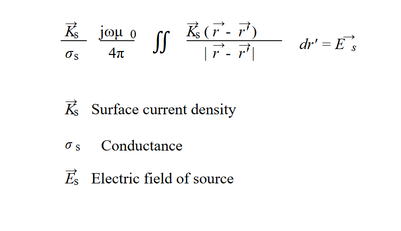
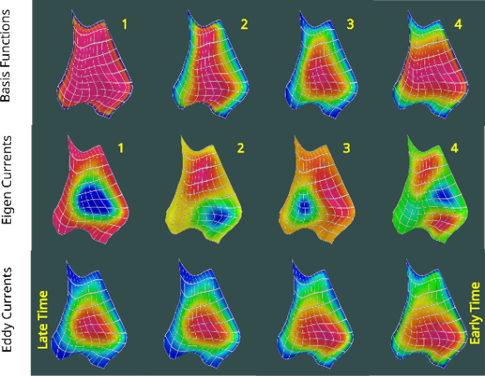
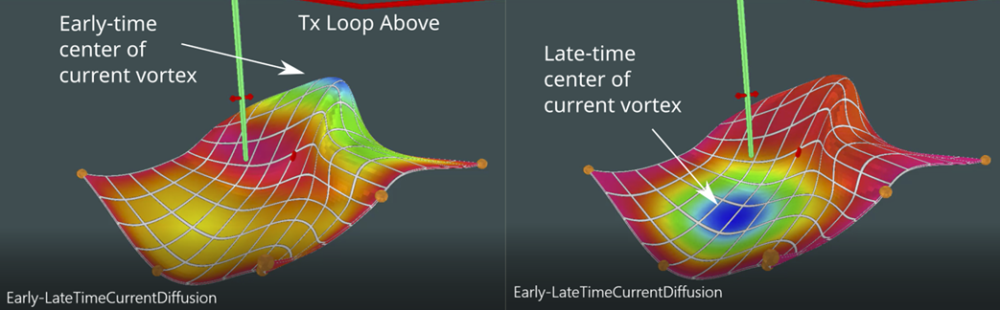

## Algorithm

A Provus simulation is based on the solution to the quasi static integral equation for the electric field, this equation is shown below.

*Integral equation in the electric field relating the local voltage drop (first term) the electric field created by all the time varying currents (second term) and the primary electric field right hand side.*

This equation which relates the surface current density on a thin sheet to the source electric field can be solved directly for each instance of source excitation and angular frequency however the approach described by Annan solves for the physics of the left-hand side in a general way. The solutions are a set of "eigencurrents" derived as linear combinations of a set of divergence-free basis functions. Each eigencurrent has a simple exponential time decay. To determine the weight of each eigencurrent in any specific solution we need only integrate the dot product of primary electric field with the eigencurrent across the surface. Surface currents are described as the curl of a vector potential having only a normal component so that the contours of the potential function are streamlines of current. Figure 2 shows the first four basis functions and the eigencurrents. The time decay (step response) for a specific transmitter loop coupling is shown in the lower row. Since Provus uses a 2D harmonic series (sin and cosine) for its basis functions it can accurately simulate eddy current systems as they migrate from early to late time.

*Comparison on a complex shaped conductor of surface current potential for: Basis functions, Eigen Currents derived from the Basis Functions and Eddy currents derived from the Eigen Currents.*

*Surface current potential on conductor of complex shape showing early to late time eddy current diffusion.*