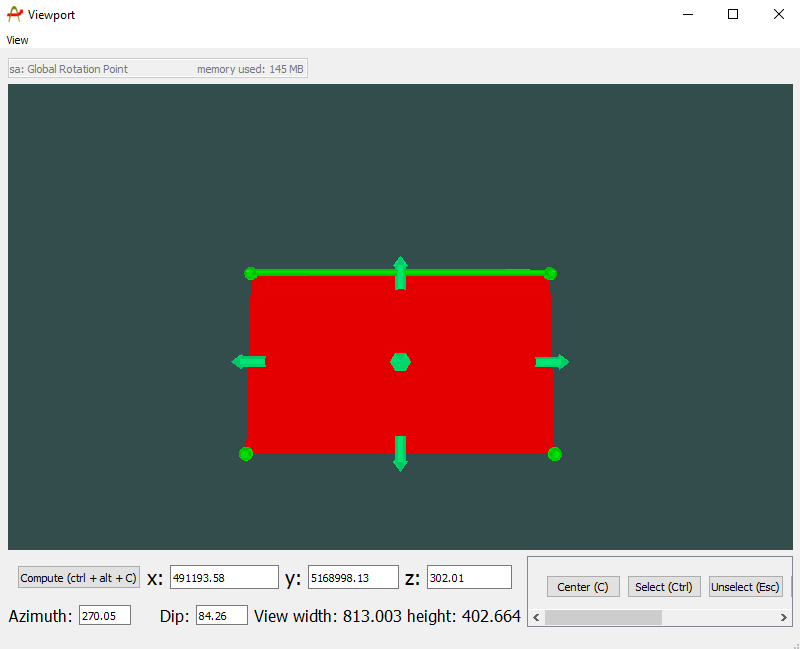
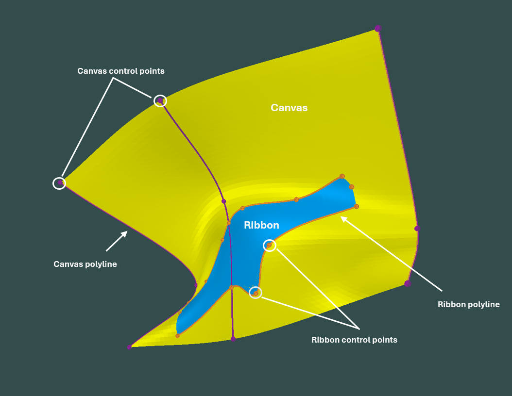

# Types of conductors in Provus

There are two distinct classes of conductors in Provus, Plate conductors and Ribbon conductors are distinct objects and are handled differently in Provus.

They are both thin sheets whose response depends only on their conductivity-thickness product which is constant on each conductor. The validity of the thin sheet approximation depends mainly on the geometry of the actual conductor relative to the distance to the receiver. If the distance of the receiver to the conductor is greater than the conductor thickness then the shape of the response of the conductor will be indistinguishable from a thin sheet although its decay may be modified at times/frequencies where the thickness is large compared to the skin depth or diffusion length.

## Plates

Plate conductors in Provus are thin rectangular sheets similar to the plates modelled in other software such as Maxwell. The implementation of plate conductors in Provus is different from the approach used in Maxwell. Provus makes no assumptions about the shape of the induced eddy currents except that they can be represented through a potential as a 2D harmonic series. In theory, allowing for an infinite number of terms in the series, this allows any divergence-free eddy current system to be formed as a solution. In Maxwell the computation is simplified considerably by assuming the eddy currents flow around the conductor in rectangular paths (ribbons) and that current cannot cross the boundary between paths. This approximation is reasonable when the primary field is constant over the surface of the plate but its response will vary significantly from that of a continuous conductor (without the ribbon restriction) when there is significant primary field gradient. This is particularly notable when a transmitter is close to a part of the conductor and the conductor is much larger than the transmitter as is often the case in airborne EM. These situations result in a signifcant change in shape of the eddy current pattern with changing time or frequency which is impossible to simulate using ribbons to describe the eddy currents.

While Plate conductors are limited to a flat rectangular form, they offer an advantage over Ribbon conductors early in the modelling process as they can be manipulated using a few parameters; location, reference point relative location, dip, dip direction, plunge, strike length, depth extent and conductance.

The Top Edge of the plate is defined as the segment of the plate perimeter between (0.0,0.0) and (1.0,0.0).

Location: The coordinates of the reference point.

Reference Point: The reference point is the point about which the the plate is rotated when the dip, dip direction or plunge are changed. It is specified in dimensionless coordinates (U,V) where (0,0) means the top-left corner,(1.0,1.0) means the lower right corner and (0.5,0.5) means the centre of the plate.

The plate coordinates convention can be seen in the figure below.

*A plate conductor object in the Provus Viewport*

Dip: the dip of the plate zero for horizontal and 90 for vertical.

Dip Direction: The direction of steepest gradient on the plate surface expressed as a geographic azimuth where x is East and y is North.

Plunge: the angle of the plate top edge to the horizontal. Note changing the plunge does not change the plane in which the plate sits, only the angle of the top edge relative to the trace of the horizontal with the plane.

The plate modelling software Maxwell assumes all plates have their reference point at the centre of the top edge (0.5,0.0). Having a variable reference point specified in relative plate coordinates is particularly for borehole EM modelling. The reference point can, for example be outside the plate (eg as (0.5, -0.5)) and this reference point can be placed to be coinicident with the hole. The axial component of the signal can be first modelled by moving the reference point up and down the hole as well as adjusting the conductor size and distance (by changing the V component of the reference point. Once the axial component is fit the transverse components can be fit by rotating the conductor around the hole using the plunge (keeping the absolute orientation constant).

## Ribbons

Provus Ribbon conductors are thin sheets that can be created by morphing a rectangle. The domain of the Ribbon is a Canvas which is itself the morphing of a two dimensional square into the 3D world. Thus the definition of the Ribbon geometry is a two stage process; defined the Canvas in the world followed by defining the Ribbon within the Canvas. In many modelling situations the Canvas will have geological significance being, for example the horizon in which mineralization occurs while the Ribbon represents the conductor within that horizon. The definitions of both the Canvas and Ribbon are integral to the definition of the Provus Ribbon Conductor. Thus each Provus Ribbon conductor requires its own Canvas. This provides the required flexibility to model complex mineral deposits comprised of multiple conductive zones.

Ribbon conductors are created in provus by promoting an existing plate conductor to a surface. This newly generated surface is the plane that the ribbon conductor is projected on to. The ribbon conductor object in Provus allows the user to have greater control over the shape of the conductor by manipulating the ribbon vertices and the surface it lies on. An example of a ribbon conductor and how a plate is promoted to a surface in provus can be seen below.

A Canvas may be created by either importing a Provus Ribbon conductor file or by promoting a Provus Plate conductor. The Provus Ribbon conductor file is a csv ASCII file containing the polylines defining the Canvas control lines in 3D and the Ribbon control lines in 2D. In cases where the model starts with a surface defined by a geological model, it is possible to digitize control lines in the geological modelling software (eg Geoscience Analyst or LeapFrog), export these lines and construct a Provus Ribbon conductor file by hand. Figure x shows an example of a series of a Canvas (translucent) defined by a series of control lines (fuchsia) which were digitized in Geoscience Analyst onto the geological model of a prospective geological horizon. The extents of the Ribbon conductor (red) were set to nominal values in the file. Once imported the outline of the conductor was modified by adding and manipulating control points (orange) so that the data in the set of six boreholes were fit.

The simplest is to promote a Provus Plate model which re-casts the plate as a Provus Ribbon. This creates a small Canvas slightly larger than and centred on the plate.

A Provus Ribbon file can also be created by hand using polylines exported from existing geological models.

*Ribbon conductor (blue) and associated canvas (yellow) in the Provus Viewport*
