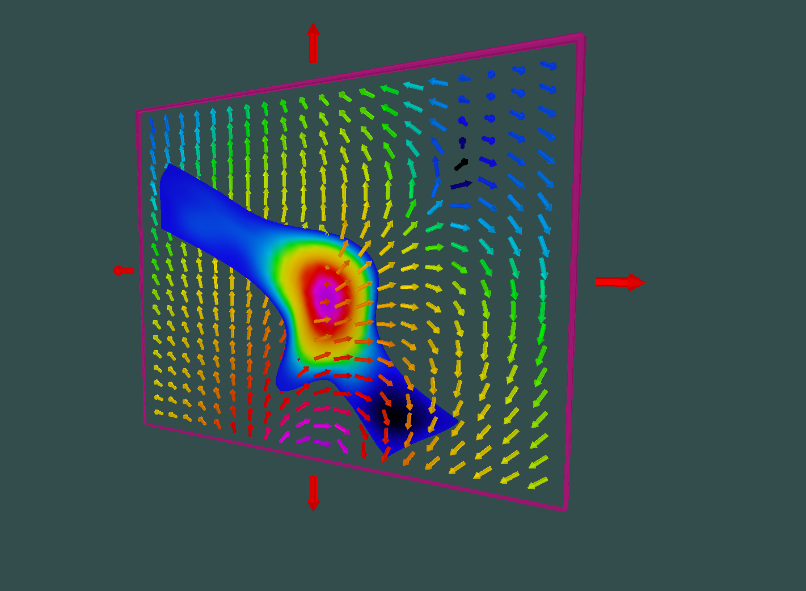

# What is Provus?

Provus has been developed by Nova Mineral Exploration Solutions for the visualisation and modelling of electromagnetic (EM) geophysical data. Provus can simulate the EM response of mineral deposits using models that can have complex conductor shapes that are often better at approximating deposit geometry than rectangular plate models. To achieve this, Provus uses structured deformable sheets as the basis for computing the eddy currents induced on the conductor surface without the need to compute a regular triangulated mesh. Control points can be freely manipulated by the user allowing both the shape and the underlying mapping used by the EM calculation to change in "real time". The ability to create complex shaped conductors and quickly view the resulting EM response makes provus a powerful tool for the modelling and interpretation of EM data.

