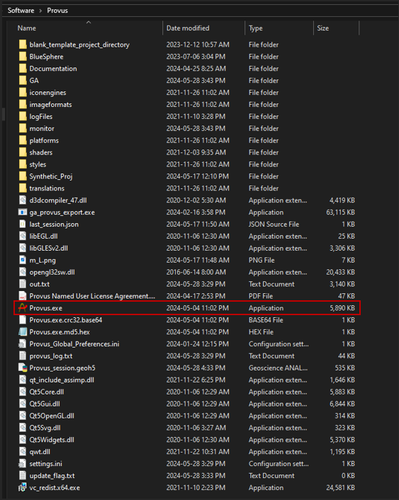

# How to install & run 

Provus is distributed in the form of a compressed file folder. The first step to running provus is to create a directory and extract the content of the compressed Provus folder to the desired directory. This can be done in windows explorer or by using third party software of the users choosing. <https://www.win-rar.com> , <https://www.7-zip.org>

To launch Provus, navigate to the directory in which Provus was extracted, double click "Provus.exe" to launch the program.

