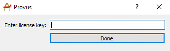
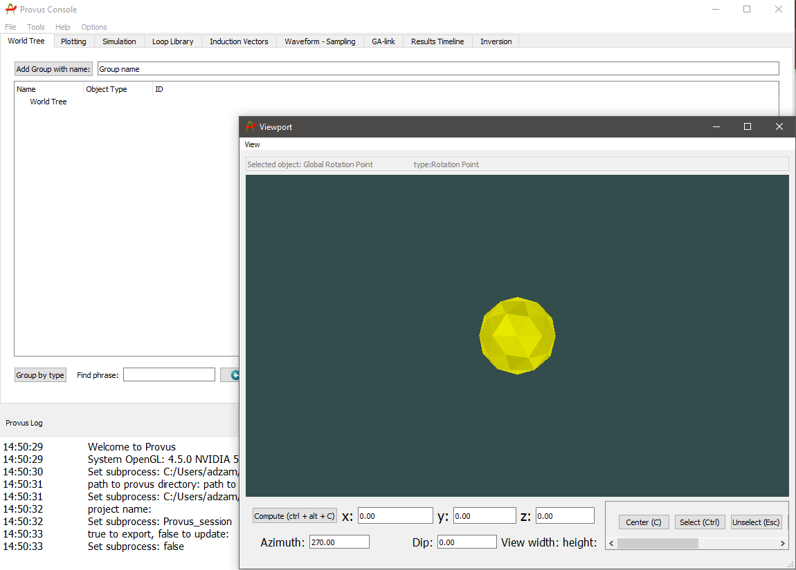

# Activating your license

When launching the Provus exe for the first time the user will be met with a prompt similar to the one shown below to enter a license key which will be provided to the user. After entering this license key the user should be granted full access to Provus.

Upon successfully launching Provus and activating a license, the user will be presented with two windows, the console and the viewport. An overview of the functions of the console and the viewport are provided below.

