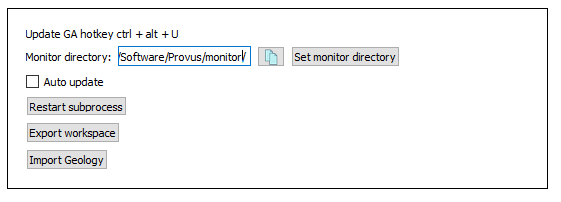
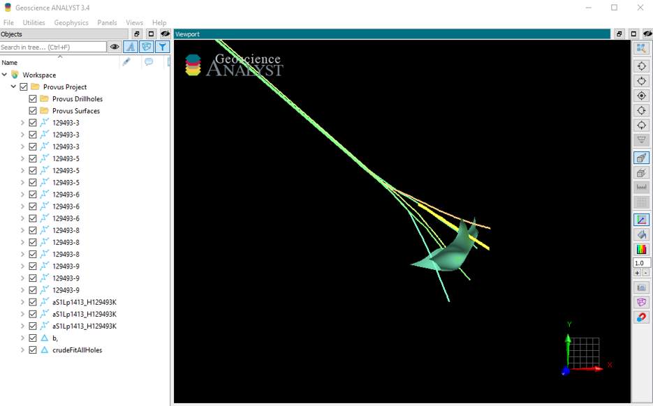

The GA-link tab of the Provus Console, when clicked, will present the user with the UI options shown below.

If the user has access to a Geoscience Analyst pro license, Provus has the ability to automatically export surfaces to the GA monitoring directory allowing for real time updating of surfaces between programs. The user can choose to enable or disable this by checking or unchecking the "Auto update" box in this widget. When the live updater is enabled all surfaces from Provus will be exported to GA and updated in real time, an example of such a workspace is shown below. The geoh5 file consists of 2 folders, one containing all data profiles in the Provus project and the other containing all conductors in the project.

If the user does not have a Geoscience Analyst pro licence but wishes to import Provus object to GA they can click the "Export workspace" button. This will generate a geoh5 file containing all surfaces and data profiles in the Provus project and place the file in the GA subdirectory located in the Provus root directory. The user can then drag the geoh5 files from this folder into a GA workspace which will load the objects into the GA viewer.

The "Import Geology" button when pressed will require the user select a geoh5 from which they wish to import surfaces. Once selected the Provus will parse the contents of the GA workspace and import and surfaces to Provus which will become visible in the viewport. This feature can be useful to compare the shape and location of ribbon conductors to existing geology models.

