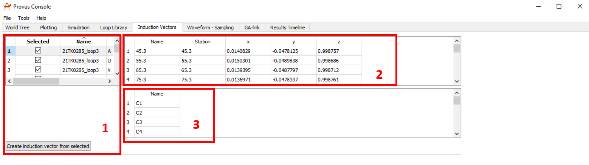
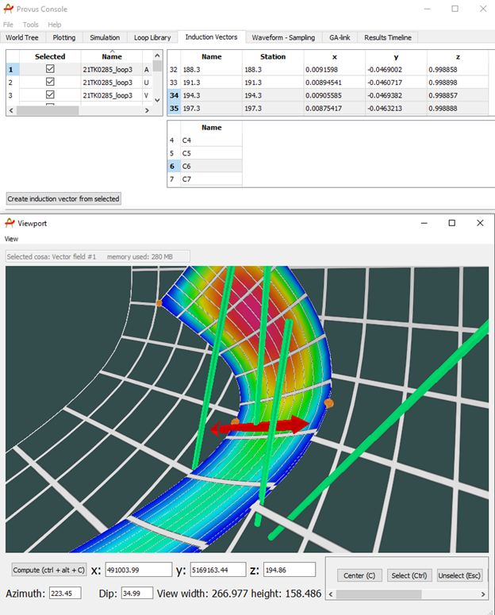

The induction vectors tab in the Provus console allows users to create a vector arrow that will point in the direction of the nearest conductor edge for a given range of stations along a profile. This feature is useful when the is an obvious crossover visible in the profile data.

1. This container lists all data profiles that are in the active Provus project, the user will select a single profile for the creation of the induction vector here by using the checkboxes in the "Selected" column.

2. The user will select the range of stations down hole or along profile for which the induction vector will span, this is done by clicking the station(s) highlighting them in blue. Hold ctrl while clicking stations to select a range.

3. The user will select the time channel of the response for the creation of the induction vector, these are selected in the same manner as the stations by clicking the name of the desired channel.

Once all parameters mentioned above have been set by the user, clicking the "Create induction vector from selected" pushbutton" will generate the induction vector and place it in the viewport. The induction vector may now be used to inform further modelling decisions. An example of what an induction vector looks like in the Provus viewport is shown below.

