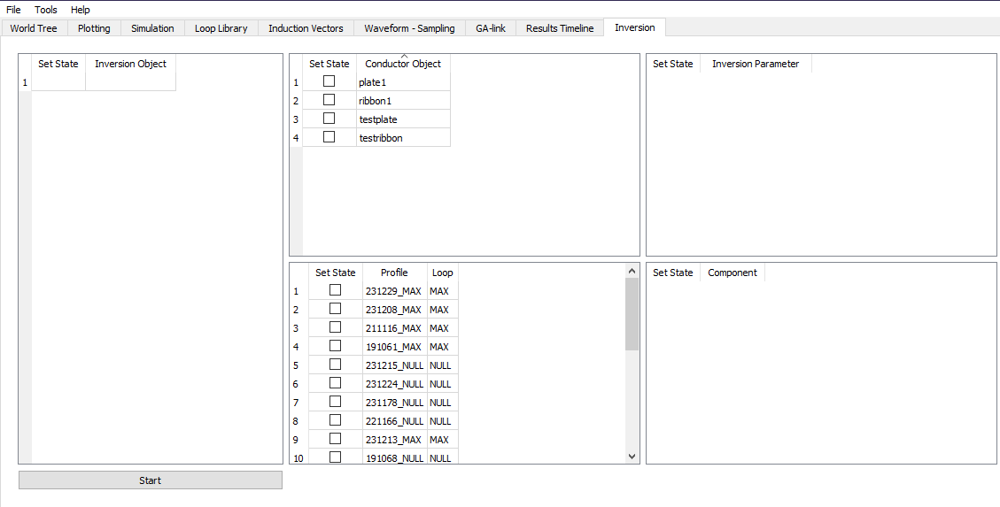

The process of adding inversion to Provus is currently underway. Having an implementation of machine assisted fitting will be highly beneficial as modelling with deformable ribbons can be challenging due to the degrees of freedom that exist, implementing an inversion routine will help greatly mitigate some of these challenges.

