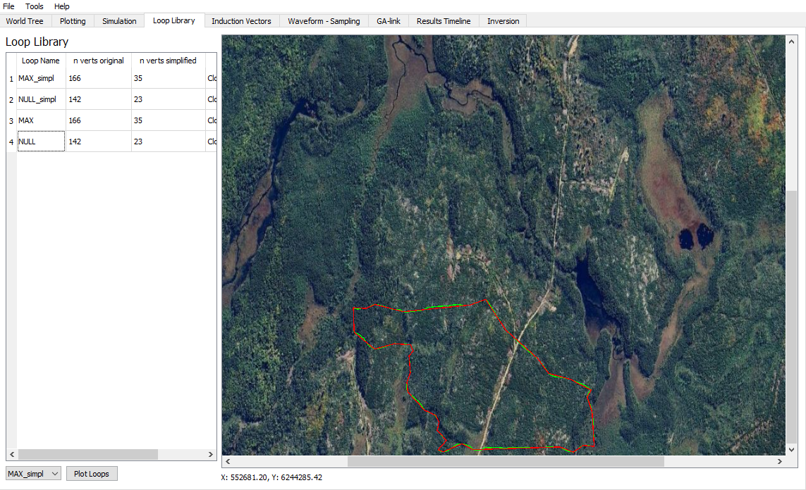

The Loop library widget in the Provus console is where the user will go to view and plot all loops that are associated with the active project. Within the widget there is a container labelled "Loop Library" which contains a list of all loops that have been imported, the list details the loop name, number of vertices in the loop, number of vertices in the "simplified loop" and if the loop co-ordinates are being read in clockwise or counterclockwise. The term "simplified loop" refers to a version of the loop that Provus automatically generates which is the same loop represented with a reduced number of vertices. The simplified loop can act as an average of many loops that vary slightly in position.

Visualizing a transmitter loop and its relative position to a data profile can be an important step in the quality control (QC) of data prior to modelling. It is possible to plot a transmitter loop in Provus by selecting a given loop from the "Loop Library" container by left clicking on the loop name and hitting the "Plot Loops" button. An example of the resulting plot is shown in the figure below. Note that the loop with the original amount of vertices is plotted in red, the "simplified" loop is plotted in green and any associated data profiles are shown in black with a circle representing the most shallow point of the profile.

