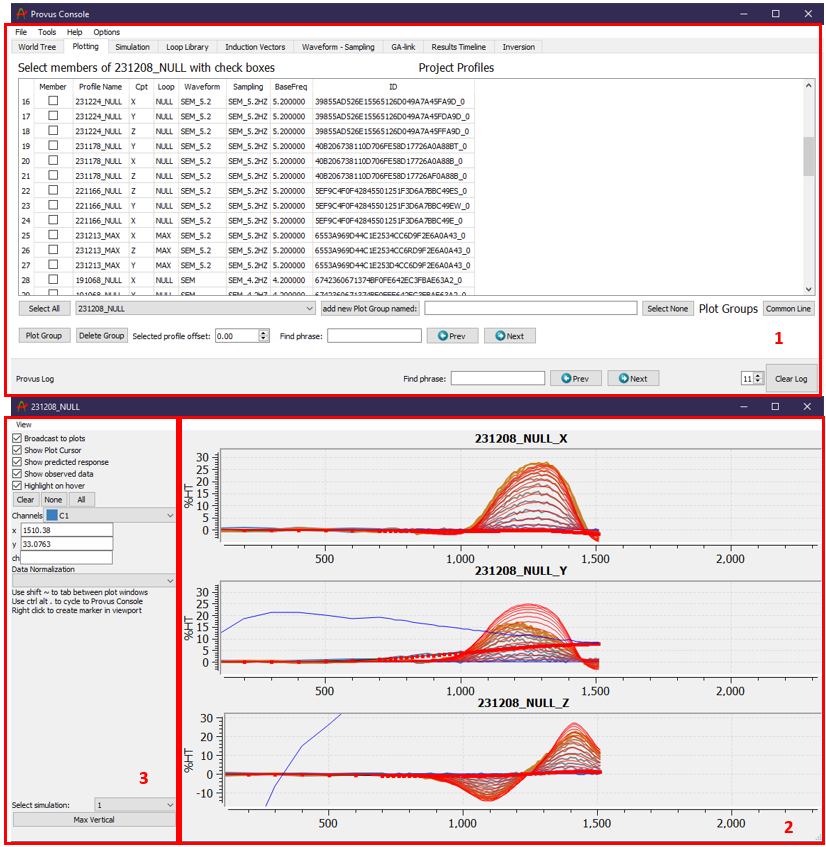
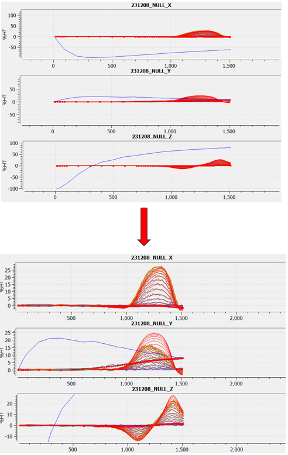
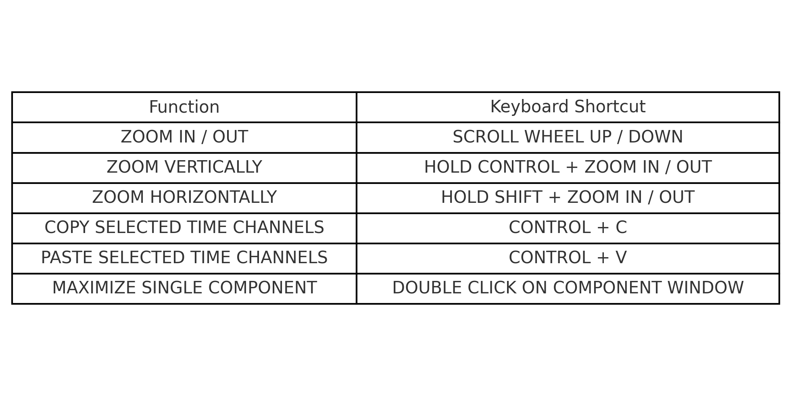

The plotting widget in the Provus console allows users to plot observed and modelled EM responses down hole or along a profile. The plotting tab will automatically display the names and attributes of any imported data profiles. Once a simulation has been completed involving any data profiles in a plotting group, the plot will automatically be updated with the modelled data in red overlying the observed data.

A detailed description of the functionality contained within the plotting widget is given below.

1. The "Project Profiles" container lists all data profiles that exist within the active Provus project. For each data profile the component, associated loop, transmitter waveform, sampling scheme, transmitter base frequency and the universally unique identifier (UUID) are listed in the adjacent columns. This container is where the user will select all data profiles to be plotted. To view plotted data the user must first create a "Plot Group". The easiest way to create plotting groups is to use the "common line" pushbutton, this will automatically group all data profiles attributed to a given hole and create a plotting group with a name corresponding to the data profile object name. Alternatively, if you wish to manually create a plotting group, the user must assign a name for the group and click the "add plot group named" push button. Once the plot group has been created the user can select the profiles to be included in the plotting group using the checkboxes in the left most column. Plotting groups can be deleted at anytime using the "Delete Group" pushbutton. Once a plotting group has been created it may be selected from the dropdown menu under the data profiles widget. Clicking the "Plot Group" push button will generate a new window with plots of all data profiles included in the selected plotting group. The "Selected profile offset" spin box located at the bottom of the container is used to compensate for any errors in data collection that has created an offset in the recorded data. The user may select the profiles to add the offset to by clicking on the profile name, now if the profiles are plotted any calculated response will be shifted by the corresponding profile offset input by the user.

2. This window will be generated when the user clicks the plot group pushbutton, it displays all the data profiles selected in the plotting group. In the above example there is only one data profile selected in the plotting (axial component), note that the measured data will be plotted in a gradient blue (early - mid time channels) and orange (mid - late time channels) and the calculated response from any simulations will be plotted in red. The calculated response is automatically updated anytime a new simulation is run containing the data profiles in the plotting group. The ability to scale and reposition the response plots is important when trying to fit a model to the measured data, there are multiple keyboard shortcuts to assist in manipulating the plot windows, these are detailed below with screen captures that show the resulting effect.

3. By default, the response(s) will be plotted with every time channel selected and with the measured and calculated primary field plotted in red and black respectively. This area of the plotting window is where users will adjust what time channels of the response are shown on the plotting axis. The push buttons above the channel dropdown menu allow the user to quickly select all time channels or select none and then individually select the channels of interest using the dropdown menu. Once the user has their preferred time channel selection, they can use the keyboard shortcut ctrl c + ctrl v to copy and paste the time channel settings to other open plotting windows. The checkboxes above the time channels allow the user to control other aspects of the plot including what data is plotted (observed or predicted) and the option to highlight the channel on hover or show the cursor when hovering over a plot.

4. Another important feature of the plotting windows is the ability to create a reference marker at a chosen distance along the profile. By right clicking on a plot at a selected distance (along profile or downhole) a reference marker will be created and will become visible in the viewport in the form of a disk protruding from the data profile. This is a useful feature when modelling and the thickness of the reference marker can be adjusted in the data profile dialog options.

### Manipulating the plotting window

* The center position of the profile can be changes by holding left click and dragging the profile.
* The scale of the response plots can be changed using the mouse scroll wheel.
* If the plotting group has multiple profiles the user can full screen one profile by double clicking on the plot area, double clicking again will return the plotting window to the default view.
* The horizontal scale of the plot may be changed independently by holding ctrl and using the mouse scroll wheel.
* If there are multiple plotting windows for different profiles the user may switch cycle between them using shift + "~"
* Pressing alt + "." will allow the user to cycle between the plotting window and the Provus console.
* Pressing the "Max Vertical" button at the bottom left of the plotting widget will automatically scale the plotting window to fill the screen vertically.

An example of a default plotted response and a response which has been scaled to increase visibility is seen below.

Shown in the figure below is an image listing all keyboard shortcuts that can be used in the Provus plotting widget.

