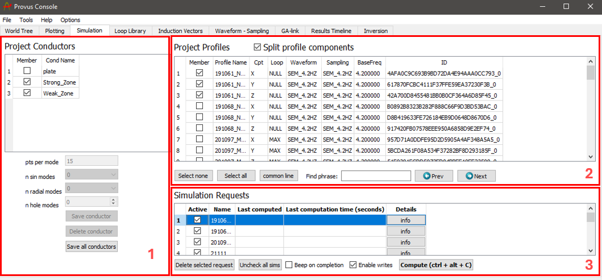
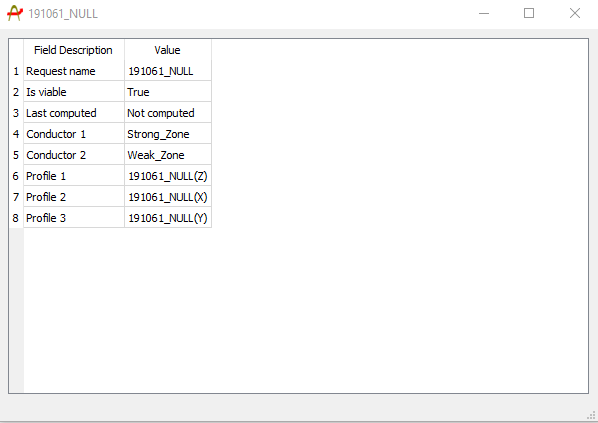

The simulation widget in the Provus console is where the user will create and compute simulation requests which consist of a selection of data profiles and conductors. The results of the simulation request(s) will be reflected in the associated plotting groups. The process of creating simulation requests and using the other functionalities of the simulation widget are detailed below.

1. The "Project Conductors" container is a list of all conductors that have been created or imported to Provus. This container is where the user will select which conductor(s) are included when running the simulation request, this is done by selecting the checkbox to the left of the conductor name. The widgets under the list of conductors allows the user to change parameters of the simulation for a given conductor and to save or delete a specific conductor or all conductors in an active project. Increasing the number of points per mode and the number of sin or radial modes will increase the accuracy of the simulation with respect to a given conductor at the expense of increased computation time. To change these parameters for a given conductor the user must highlight the specified conductor(s) by clicking on the conductor name, this will result in the conductor being highlighted in blue. Once this is done, changing the number of modes or points per mode will results in this variable being saved for the given conductor(s). The ability to vary these parameters can prove useful for a case where a user is performing a simulation with multiple conductors and one conductor has a much larger impact on the response over a profile in comparison to the other conductor(s) in a simulation. For such a case the user may wish to increase the number of modes for the conductor with the largest influence on the response while decreasing the number of modes for conductors at a greater offset with less influence. To save or delete a specific conductor, highlight the conductor by clicking on the name then click the "Save Conductor" or "Delete Conductor" button, additionally, clicking the "Save All Conductors" pushbutton will save all conductors to the "Provus Conductors" folder in the project directory.

2. The "Project Profiles" container lists all data profiles that exist within the active Provus project. For each data profile the component, associated loop, transmitter waveform, sampling scheme and transmitter base frequency are listed in the adjacent columns. This container is where the user will select all data profiles that will be considered for the simulation request. The data profiles are added to the active simulation request by selecting the checkbox to the left of the "Profile Name" column.

3. The "Simulation Requests" container is where all simulation requests are listed and created. A simulation request is created in this container by clicking on the empty cell under the "Name" column and entering a name. Once a name has been assigned the request will be present in the container and the user may select the profiles and conductors to be included in the simulation. Alternatively, clicking common line will create a simulation request for each set of data profiles in the project. Once the request has been made the user must make it active by selecting it using the checkbox to the left of the simulation name. To compute the simulation the user can use the keyboard shortcut (ctrl + alt + c) or click the "Compute" pushbutton. The simulation request will be highlighted in red during computation and will be highlighted in green upon completion. Clicking the "info" button for a given simulation request will create a new window showing the conductors and profiles involved in the simulation and the last time of completion. This info dialogue window is a useful QA check to make sure your simulation is behaving as expected. An example of the info dialogue window is shown below. Multiple simulation requests can be active at a given time using the checkboxes, simulation requests may also be deleted by selecting the request and clicking the "delete selected request" button.

