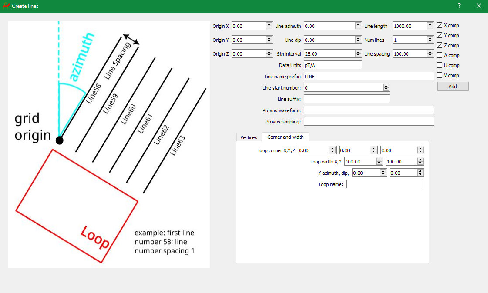

## Taskbar

The taskbar is located at the top of the Provus console window, the "File" dropdown menu contains functions that are used to create a new project, import data and import existing plate conductors. The "tools" dropdown menu provides functions for generating a synthetic borhole or ground survey and generating UUID strings to populate the header of .TEM files. The features contained in the "File" and "Tools" dropdown menu are detailed below.

* **Load Project File (.ppf)**
    * This will prompt the user to select the Project File (.ppf) file to load the project. The project file contains paths to all of the data that make up the project. The project file must reside in the project directory which contains other directories and files necessary for Provus's operation.

* **Load Maxwell plates**
    * This will prompt the user to select an existing Maxwell plate definition files (.pte) for the current project. Once imported the plates will be visible in the viewport and the world tree in addition to being available as a conductor to be selected for simulation.

* **Add viewports**
    * Selecting this will generate an additional viewport, this can prove useful when trying to center the viewport on two different features or regions.

* **Provus log verbosity**
    * When checked Provus will dump logs of activity in the open command window.

* **Load last workplace**
    * This will automatically load the last active Provus project.

* **Open active project directory**
    * This will launch windows explorer in the root of the currently active Provus directory.

* **Save state**
    * This will save the current state of the project in Provus including all conductors and simulation results.

* **Load state**
    * This will load the last saved state of the active Provus Project.

* **Create empty project**
    * When selected Provus will generate am empty project directory with all required sub directories for the user to then populate and read in.

* **Load synthetic data**
    * This will open windows explorer and allow the user to import synthetic data in the form of a .csv file, the expected formatting of this file is detailed in the formatting section of the documentation.

* **Generate UUID**
    * Located in the "Tools" tab of the Provus taskbar, this option will generate a UI which creates UUIDs for the user to then populate the header of any .TEM files they wish to import.

* **Create synthetic data**
    * Under the "Tools" option in the taskbar there are two functions that allow the user to create synthetic borehole or ground data profiles, these functions are called "Create borehole" and "Create lines" respectively. The process to create synthetic lines or boreholes in Provus will be somewhat familiar to Maxwell users. Once selected, a new UI window will open and the user will be able to define the origin, azimuth, dip and length of the lines, number of lines, line spacing, station spacing and the components of the response to be calculated. Additionally, the data profiles must be given a naming scheme, expected data units and must give the name of a pre-existing waveform and channel sampling scheme located in the Provus options directory. Finally the user must define an associated transmitter loop, the loop may be defined by either a list of vertices or by a corner and width, the loop must also be assigned a name. Included below is a image showing the UI of the "Create lines" window. Once the user has finished and clicks "Add" Provus will generate a .csv file containing the profile and loop information and this csv file will be automatically placed in the synthetic folder in your project directory resulting in it being loaded into your active project.

