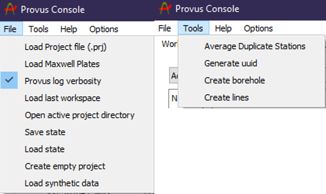

The taskbar is located at the top of the Provus console window, the "File" dropdown menu contains functions that are used to create a new project, import data and import existing plate conductors. The "tools" dropdown menu provides functions for generating a synthetic borhole or ground survey and generating UUID strings to populate the header of .TEM files. The features contained in the "File" and "Tools" dropdown menu are detailed below.

