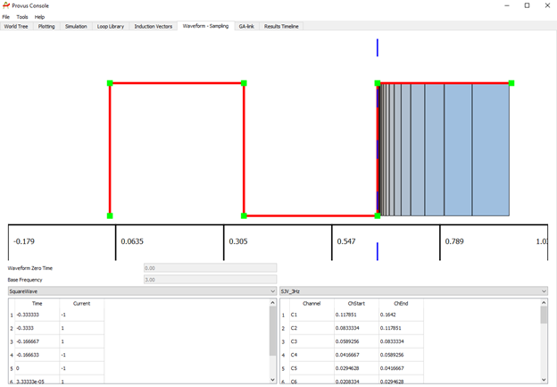

The Waveform-Sampling widget of the Provus console is used to review the channel sampling schemes and the waveforms that are included in the active project directory located in the "Provus_Options" sub directory. The waveform and channel sampling associated with the active project will automatically be plotted upon clicking the "Waveform-Sampling" widget. An example of this plot can be seen below.

The waveform is plotted in red and each data point comprising the waveform is highlighted in green, the windowing is shown in blue. Underlying the plot of the waveform and time windows there is two containers and two associated dropdown menus. The left container displays the time and current of the waveform selected in the dropdown menu. The right container displays the selected waveform sampling scheme including the channel, channel start and channel end. The ability to see the waveform and sampling scheme can help with troubleshooting and QC of data upon import.
