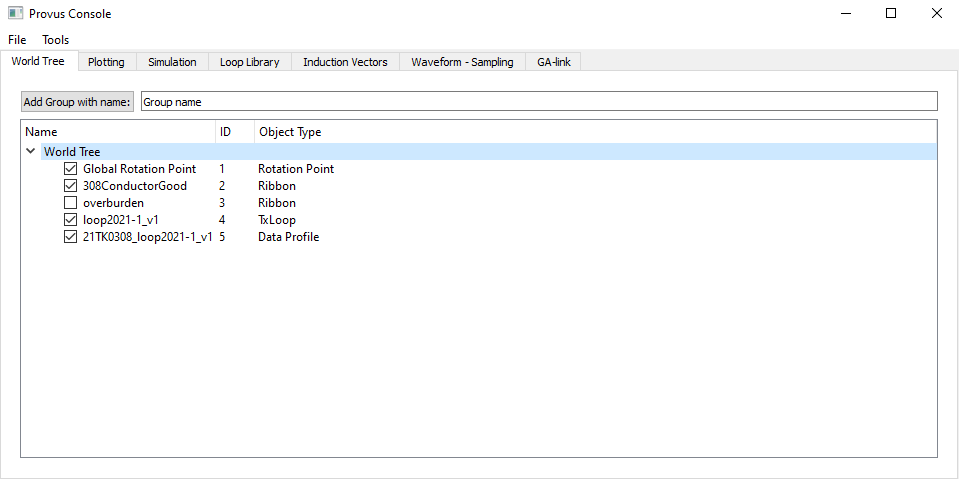

The world tree lists all objects that have been created or imported to Provus for a given project. This includes conductors, drillholes, geology models, transmitter loops and more. The world tree displays the object name and the object typing which is displayed in the column to the right of the name. 

By clicking the "Object Type" column header, the objects in the world tree will be sorted by object type. In the world tree widget, the user may toggle what elements of a project are visible in the viewport, this is done by using the checkbox to the left of the object name. This is an important feature for the purposes of being able to focus on elements that may be obstructed by other surfaces while navigating in the viewport. The user is also able to create groups of objects within the world tree, this could be useful for delineating between groups of drillholes or conductors. 

Finally, by double clicking on any item in the world tree the object specific dialog for the given object type will open in a new window. An example of the world tree is seen below, where the elements of a typical project file are listed.

