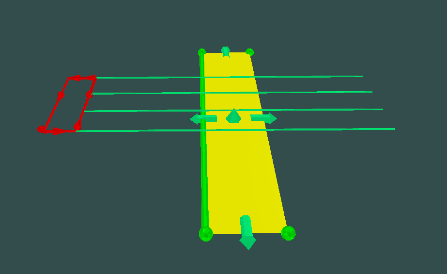
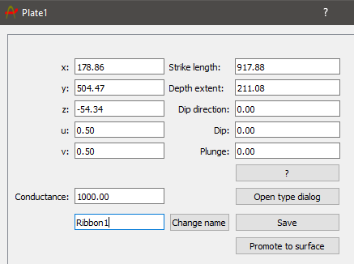
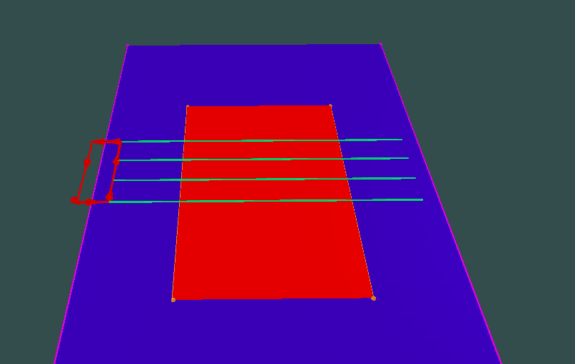
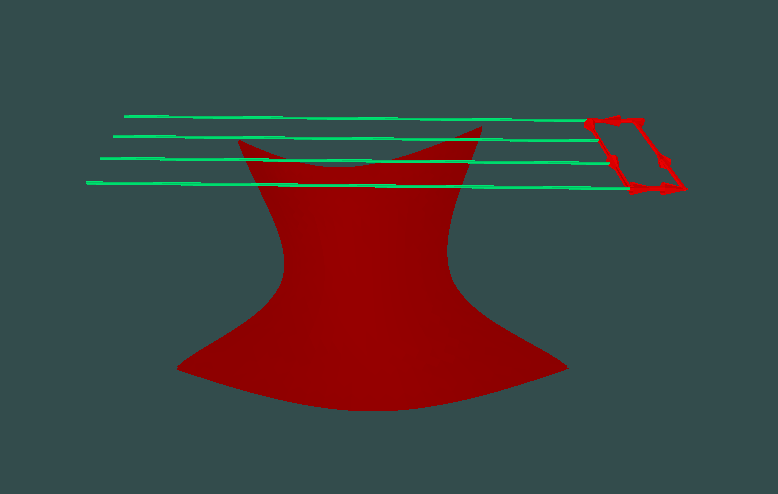

Next we will create a conductor and simulate the response over one of our newly created synthetic lines. First navigate to the viewport and right click on the mouse while holding control, select "Create plate here" this will generate a plate conductor at the approximate position of your cursor. 

To create a more complex conductor we can promote our newly created plate to a surface by selecting the plate and clicking the enter key to bring up the "Plate Object" dialog window, then give the new ribbon conductor a name and click "Promote to surface". 

Lets move the plate to be centered under our data profiles and calculate the response. Navigate to the plotting tab and click "Common Line" this will group the x,y,z components for each line and from the dropdown menu we can select a line to plot. This will create a ribbon conductor and populate it in the viewport. For a refresher on how to manipulate ribbon conductors and their properties visit the "Provus Options" seciton of the user guide or use the search function. 

Once you are finished manipulating the ribbon you are ready to create your first simulation request using our newly created conductor. 

