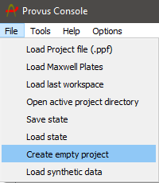
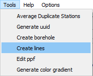
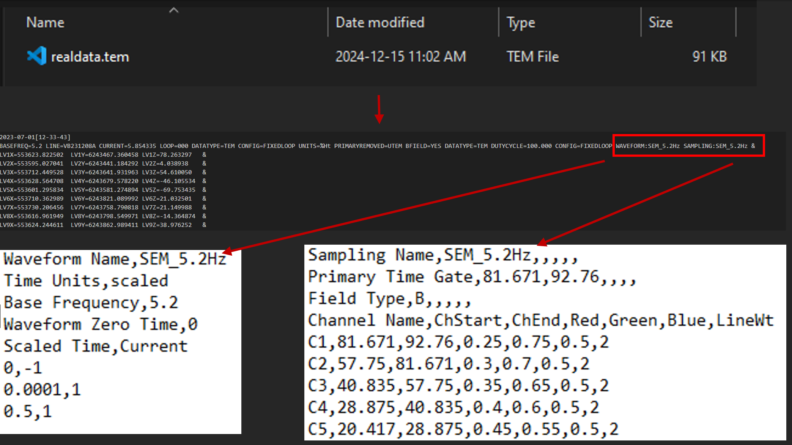
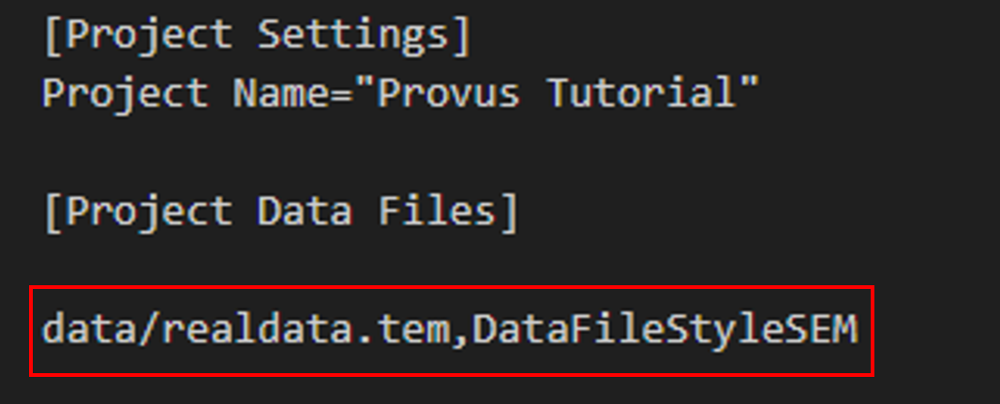

# Creating a synthetic model 

This section will walk you through how to quickly get up and running with synthetic data in Provus. The first step is to create an empty project using the "Create empty project" option in the "Tools" menu.

Upon clicking "Create empty project" Provus will prompt you to select a folder in which to populate with content (folders) of this new project. Once you select a folder the next step is to load this new empty project, so we will click "File" -> "Load project file (.ppf)" then navigate to the newly created folder and select the .ppf project file. 

Now we will have loaded our new project, which contains waveform and channel sampling files, meaning we are ready to create some synthetic data profiles. To do this we will navigate to "Tools" -> "Create lines" or "Create boreholes" depending on which type of data you are modelling, in this example we will create synthetic surface data profiles. 

You will be greeted with a UI window that will allow you to define the properties of your synthetic data profile (origin, azimuth, number of lines, station spacing x,y,z / a,u,v etc). 

An important thing to note is the two variables **Provus waveform** and **Provus sampling** these values must be the names* of a waveform definition and channel sampling .csv file which exist in your project's "Provus Options" folder. Towards the bottom of the UI window you are asked to define the loop associated with your data profile(s), once you define the loop and assign it a name you can then click "Add" which will complete the profile generation and prompt you to save it with a name. After successfully assigning your data a name the profiles and transmitter will automatically be populated in the Provus viewport / world tree and you can move on to creating conductors and performing simulations. 

# Importing .tem data 

This section will walk you through how to prep your data (.tem) files to be imported into Provus, the first step remains as when creating synthetic data, creating an empty project. So lets create an empty project, then we are going to create an additional folder in the empty project directory called "data", place all the .tem files you want to import into Provus here. 

Next we need to prep our .tem file(s) by adding two addition variables, "WAVEFORM:" and "SAMPLING:" the value of these should be the **Name** of the associated channel sampling and waveform definition .csv files in "Provs_Options" folder in the project directory. So for our .tem file we add the following to the header line: "WAVEFORM:SEM_5.2Hz SAMPLING:SEM_5.2Hz &"

Now we need to tell Provus where to find our .tem files so we will open the project file (.ppf) in a text editor and under "Project Data Files" we add a line for each .tem file where the lines consists of:

"Path_to_tem_file.tem",DataFileStyleSystem"

so, for our fake data our project file would look like below: 

"DataFileStyle" is informing Provus of the expected style of data so it can be loaded correctly, currently provus has implemented data loaders for the following data styles (note that loaders can be implemented quickly on request for your data style):

Everything should be all set now, so in the Provus console we can now go to "File" -> "Load Project File (.ppf)" and the .ppf file in the root of our newly created project, note to keep an eye on the Provus Logs at the bottom of the console UI window as it will provided crutial error logging if some data is not being loaded correctly. 