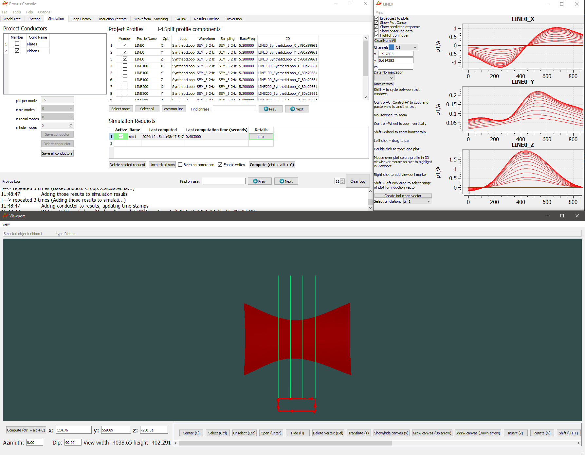

Moving over to the "Simulation" tab, we need to create a "simulation request" and tell provus which conductors, and data profiles to include in our request, so first, double click under the name column to create a request and give it a name, then we use the checkboxes to select the x,y and z components of Line0 and select "Ribbon1"as our conductor. Once we have confirmed the contents of our simulation by double clicking on the request name, we click "Compute" and switching to our plot of Line0 we can see the simulated response in red. 

The iterative process of fitting conductors to field data now begins, there are multiple tools to help make this process easier, namely, "Induction Vectors" and the ability to import Geology & Drillhole data from .geoh5 files. There are many nuances involved in modelling in Provus, particularly the ribbon dialog window and the simulation tab contain alot of crutial functionality, we encourage you to use the search function of this documentation to learn about all the tools Provus has to offer.