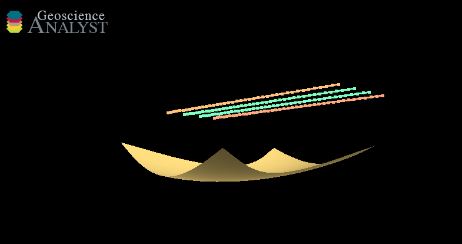

Once you have finalized a model, the simulated responses can be found stored as .tem files in the tem export folder in the project directory. All conductors in the project are stored in the Provus conductors folder of the project directory in csv format, additionally you can export the contents of your Provus project to a .geoh5 project to view your conductors next to all of your other data. Reminder to export the project contents to a .geoh5 file navigate to the "GA-Link" tab in the Provus console and select "Export Workspace". 

