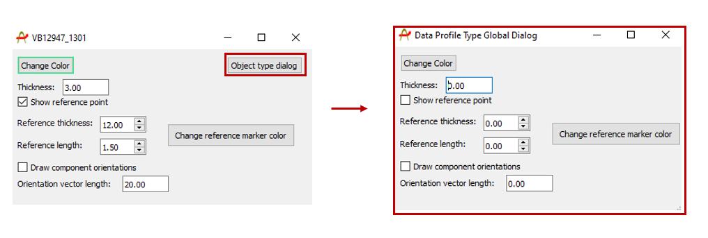
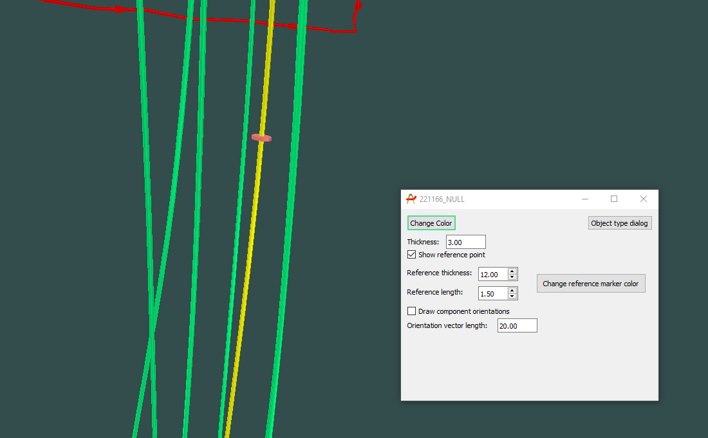
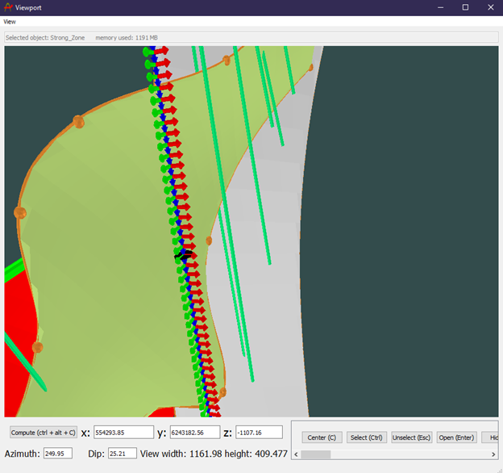

## Importing / Creating
A data profile in Provus is considered to be any set of points that share a common transmitter, transmitter waveform, waveform sampling and loop. Any data profiles imported to provus will be available for selection in the plotting and simulation widgets of the Provus console.

Data profiles may be imported into Provus in the form of a .TEM file or a data profile may be created and imported to provus as synthetic data. To import existing data to be modelled, the user must first identify the what style sheet to use when importing the data, this will depend on the system used to perform the survey. A table of existing style sheets is shown in the appendix, it should be noted that additional style sheet importers can be implemented upon request. Once the user has determined which style sheet is appropriate for their data set, they must then navigate to the .prj file in the project directory and add the names of the .TEM files and the style sheet (seperated by a comma) under [Project Data Files].

## Object specific dialogue

Upon being imported to Provus the user may navigate to the data profile in the viewport and open the object dialog using ctrl + left click + enter. Alternatively, the object dialog window may also be accessed by double clicking on the data profile name from the world tree in the Provus console. Any changes that are made in this dialog window will only effect the selected data profile, clicking the "object type dialog" pushbutton will generate an identical window that will apply any changes to all data profiles in the project. An example of these UI windows are shown below.

The dialog window will allow the user to change the color, thickness and toggle the component orientation vectors of the selected data profile. Changing the color of different data profiles can help distinguish between different data profiles when looking at the viewport. Note that like all object dialogs, there is a button in the top right called "Object type dialog" pressing this button will open a new UI window in which any changes will be applied universally to all data profiles in the Provus project.

In this dialog window there is a checkbox to make a "reference point" visible in the viewport, this reference point is a disk of user determined size which marks the location down hole that has been selected in the associated plotting window by right clicking at a chosen depth or distance. The length and thickness of the reference marker and its color can be changed within this object dialog. This is useful as it provides the user with the ability to correlate any features of the response to a location in 3d space downhole or along profile. An example of a reference point being applied to a borehole in the Provus viewport is shown below.

When the "Draw component orientation" box is checked, red, green and blue arrows will be populated along the profile or down hole in the Provus viewport, the length of these arrows can be changed by the user with the corresponding "Orientation vector length" option in the object dialog. The ability to plot the component orientations down hole or along a profile is a powerful tool to use when modelling and as a QAQC tool. An image is shown below in which the color of the arrows correspond to the component of the response (RGB = XYZ = AUV)

