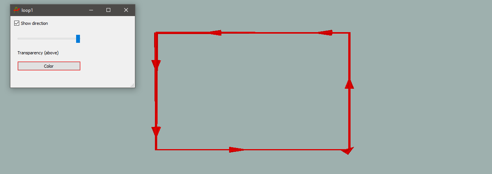

## Importing / Creating
For Provus to be able to import a data profile, the profile must have an associated transmitter loop, the transmitter object is imported to provus as .tx file located in the data directory or the loop must be defined within the .tem file that is being imported. 

a txloop.tx file consists of the loop x,y,z coordinates in a space delimited file (note the loop must not be closed). It should be noted that the waveform and channel sampling of the transmitter is handled seperately by Provus and is included in the header of the data profile. Once imported successfully, the loop will be visible in the provus viewport and the loop library widget in the Provus console. Below is an example of a .tx file which must be in the data directory if a loop is not defined in the .tem file. 

## Object specific dialogue
The loop object dialog allows the user to change the color of a given transmitter loop in the viewport as well as toggling 3d arrows which show the direction of current flow within the loop which can be an important qaqc check.

Once a transmitter loop has been successfully imported to Provus, the user may open the object dialogue by navigating to the loop in the viewport and holding ctrl + left click + enter. The loop object dialog allows the user to change the color of a given transmitter loop in the viewport as well as toggling 3d arrows which show the direction of current flow within the loop which can be an important qaqc check.

