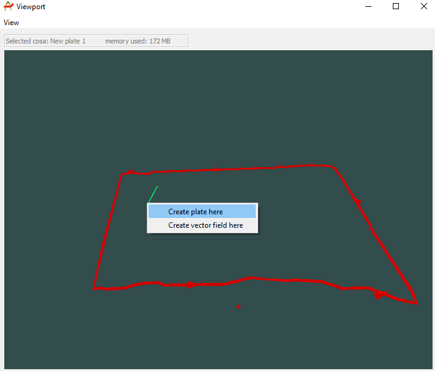
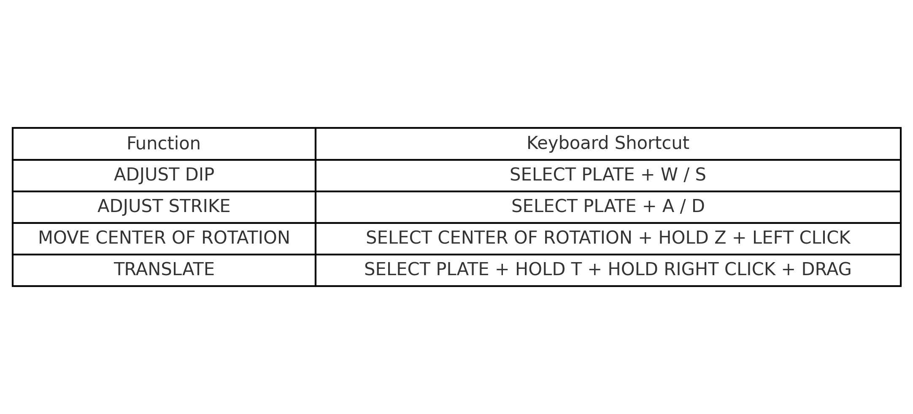

## Importing / Creating

Plate conductors are a class of object that can be imported to, or created within Provus. They are used in the calculation of forward models and are the starting point when creating any complex conductor shapes in provus. To create a plate conductor in Provus the user can navigate to the provus viewport, pressing ctrl + right click will bring up a dropdown menu with "create plate here" listed as an option. Selecting this option from the dopdown menu will create a plate conductor centered at the cursor position in the view port. An example of this process can be seen here: <https://youtu.be/rG0ImonHzfA>

Alternatively, if the user wishes to bring in previously generated plate models they may do so by navigating to the provus console, clicking the "file" dropdown menu and selecting "import plate". This allows any .pte files to be imported to Provus, upon import the new plate will be visible in the world tree, simulation widget and viewport.

## Object specific dialogue

Once a plate object has been created or imported to Provus, the next step is to interact with the plate using the object dialogue. To open this dialogue, hold shift + left click, the plate should now be highlighted in yellow, press enter to open the object dialogue window. This window is where the user will go to change parameters of the plate in Provus, an example of this UI window is shown below.

The process of accessing this dialogue window is shown here: <https://youtu.be/nK1uBslG1Tg>

The options available to the user are detailed and defined below:

1. This section of the plate dialog UI is where the user can vary the size, orientation and conductance of the plate. A brief description of each parameter is listed below: 

    * **Location (x,y,z)**
        * Location of the center of the plate in the viewport

    * **Center of rotation (u,v)**
        * Local coordinates of the plate center of rotation
    
    * **Strike length & Depth extent**
        * Dimensions of the plate in meters

    * **Dip**
        * Dip of the plate in degrees

    * **Dip direction**
        * Dip direction of the plate in degrees 

    * **Plunge**
        * Plunge of the plate in degrees

    * **Conductance**
        * Conductivity thickness parameter

    * **Change name**
        * Changes the name of the plate
    
    * **Open type dialog**
        * This will open another UI window in which changes will be applied to all plate objects in the project opposed to the currently selected plate
    
    * **Save**
        * Saves the plate conductor locally to the provus conductors subdirectory

    * **Promote plate to surface**
     * Converts the active plate to a surface object allowing the user to add and manipulate vertices to create ribbon like conductors

    
    
2. This section of the plate dialog UI allows the user to paint the plates surface with different data sets that are stored from simulation requests. The user may select the specific simulation request and transmitter loop being referenced from the dropdown menus. A brief description of each function is listed below:

    * **Paint channel eddy currents**
        * Paints the eddy current channeling on to the highlighted plate for the selected time channel

    * **Paint Eigen function order**
        * The field leakage acts as a quality control tool, leakage of fields through plate boundaries is representative of some inaccuracy in the calculation.

    * **Paint primary field**
        * The field leakage acts as a quality control tool, leakage of fields through plate boundaries is representative of some inaccuracy in the calculation

    * **Paint % field leakage at distance**
        * The field leakage acts as a quality control tool, leakage of fields near the center of the conductor is representative of some inaccuracy in the calculation.
        
    * **Plate color**
        * Allows the user to change the color of the selected plate in the viewport
        
    * **Plate transparency**
        * The slider allows the user to change the transparency of the selected plate in the viewport

    
    
3. The text box at the top of this section of the UI displays the path to where the conductor is stored locally. Directly under this text box the user can change the ratio increment for the dip and dip direction of the plate. This can be used to fine tune the level of granularity required when changing plate parameters. In this section of the UI there is a list of checkboxes the user can toggle on or off depending on their needs. These options are detailed below:

    * **Symmetrical stretch**
        * When checked, this will make it so that when you drag the arrows on a plate to increase or decrease the size, it will apply this change to both sides of the plate equally

    * **Show center of rotation**
        * This option, when checked, will make the center of rotation for the plate visible in the viewport
        
    * **Show top reference**
        * This option, when checked, will make the top reference visible in the viewport
        
    * **Show control verts**
        * This option, when checked, will make the vertices of the plate visible in the viewport
        
    * **Quick updates**
        * This option, when checked will quickly and automatically update the modelled response in the plotting window, this gives the effect of a near real time modelling experience. It should be noted that the quick update is only accurate under the assumption that the changes made to the plate or ribbon are relatively small. For this reason the user should use this feature when fine tuning edges of conductors and remember to manually run simulations periodically to confirm the accuracy of the quick updates. 

    * **Undo & Redo**
        * These buttons will revert or restore and changes made to the plate. 

## Viewport controls 

There is a multitude of hotkeys and commands built into the Provus to assist with moving and modifying plates in the viewport. A summary of these options are presented below, for each option there is an included link to a screen capture showing how the given translation effects a plate or surface. Follow the link to see a video example of these operations in Provus <https://youtu.be/hjFcEmjZetM?list=PL2FoQ-hwPjsNGx7DwilC70TTd7--sUrgF&t=265>

* Select edge arrow and drag to stretch plate edge 
* Select corner vertex and drag to rotate in plane 
* Select plate and press W/S to change dip angle 
* Select plate and press A/D to change strike angle 
* Select plate, hold "T" and drag to translate  
* Select local center of rotation (pyramid), hold T and drag to translate, keeping plate still
* Select local center of rotation (pyramid), right click and drag to change plate position with respect to fixed center of rotation 
* Select local center of rotation (pyramid), hold Z and click on any object in viewport to snap center of rotation to that point. Plate will stay fixed in plane, translate normal to plane 

Below is an image containing all of the viewport keyboard shortcuts when interacting with plate objects.

