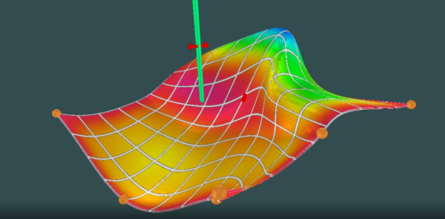
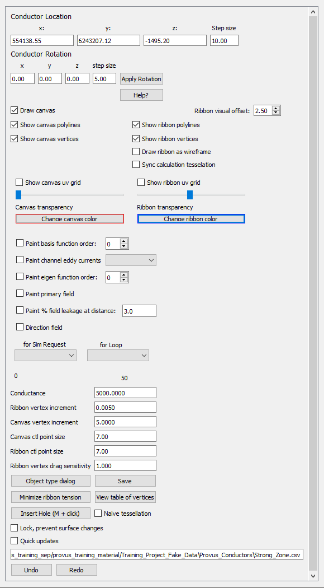
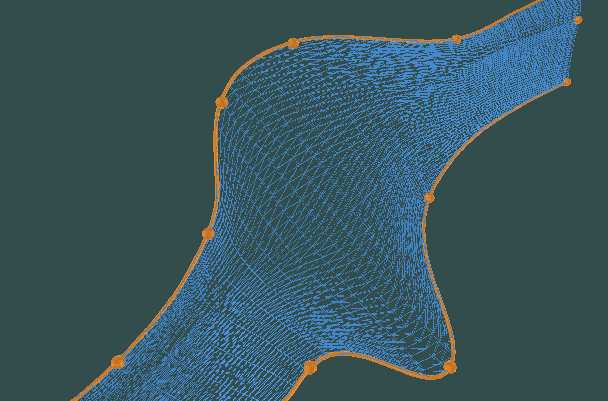
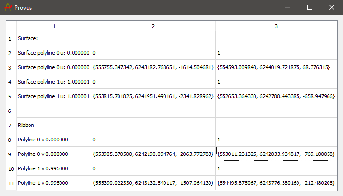
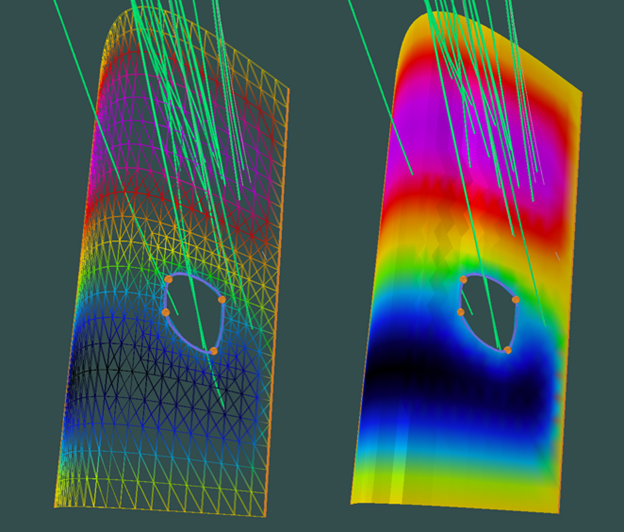
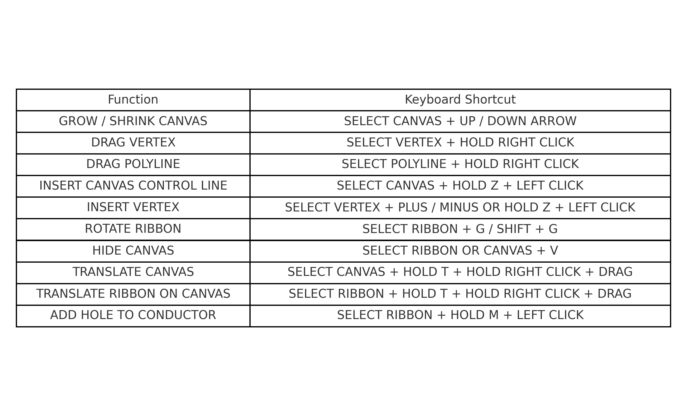

## Importing / Creating

Once a plate has been created or imported to Provus the user has the option via the plate object dialogue to "promote to surface". This will allow the user to create a new ribbon conductor object which they are then able to use to create complex shapes. 

## Object specific dialogue

Once a plate has been promoted to a surface, it will be recognized as a new object and will appear as a seperate entity in the viewport and the world tree. Highlighting the new surface with CTRL + Left click and pressing enter will open the ribbon object dialog. The parameters in the object dialog that are unique to ribbon conductors are shown and described below:

* **Draw surface**
    * toggling this will hide or render the surface of a ribbon

* **Show surface or ribbon polylines, vertices and uv grid**
    * Toggling these options will either hide or render the respective properties of the ribbon and associated surface

* **Draw ribbon as wireframe**
    * Selecting this will render the ribbon conductor as a wireframe and any value that is painted on the ribbon will also be rendered as a wireframe. This can make it easier to visualize radial basis functions, eddy currents or other paintable attributes, see the image below

* **Ribbon vertex increment**
    * The spacing between ribbon vertices

* **Surface vertex increment**
    * The spacing between surface vertices 

* **Surface control point size**
    * Allows user to increase or decrease the size of surface control points for more broad or fine transformations

* **Ribbon control point size**
    * Allows user to increase or decrease the size of ribbon control points for more broad or fine transformations

* **Ribbon vertex drag sensitivity**
    * Increase or decrease the relative distance a ribbon vertex will be translated along the canvas as it is dragged by the user

* **View table of vertices**
    * When clicked, a new ui window will be generated which consists of a table containing the polyline co-ordinate that make up the surface and the ribbon. The entries under the "polyLine3D" header are the x,y,z locations of the vertices that comprise the canvas polylines. Row entries under the header "polyLine2D" represent the x,y,z locations of the vertices that comprise the ribbon polylines.

* **Minimize ribbon tension**
    * If you see any irregularities in your ribbon conductor after extensive manipulation (vertices that have become twisted or pinched), this option can help return the conductor to a state where the ribon lies flat on the canvas and the boundaries of the conductor are coincident with the boundary as defined by the polyline.

* **Insert Hole (M + click)**
    * If the user holds the "m" key and left clicks while having a ribbon conductor selected, a hole will be generated in the ribbon conductor at the approximate location of the cursor. The dimensions and locations of this hole in the conductor can be changed by selecting the hole vertices and drag while holding right click. This can help when modelling borehole data in which the hole is travelling through a known conductive body but is passing through a gap in mineralization. A visualization of a user generated hole in a ribbon conductor and its effect on the radial basis function distribution across the conductor can be seen below.

## Viewport controls 

A user will commonly use a ribbon conductor to create a more complex conductor shape in order to achieve a better fit to the observed data. To facilitate the manipulation of the shape there is additional movement shortcuts in the viewport available to ribbon conductors which are detailed below.

* Select surface or ribbon using CTRL + Rick click and press Enter to open the dialog window <https://youtu.be/LnAawRJ0le0>
* Select surface vertex and right-click-drag or use W/A/S/D/Q/E/R/F to move vertex in 3D 
* Select a ribbon or surface control point and drag with right mouse button <https://youtu.be/7_qJ1e_fg-U>
* Select a ribbon or surface and drag with right mouse button while holding "T" to translate the ribbon or the surface 
* Select surface or ribbon vertex and hit "+" to add a new control point between it and the next vertex along control line 
* Select surface or ribbon and hit "-" to add a new control point between it and the previous vertex along control line 
* Select surface or ribbon control point and hit DEL to delete the vertex 
* Hold "Z" and click on surface to add a new control line going through that point on the surface 
* Select surface and press "G" to rotate around global rotation point by 2 degrees, or whatever the rotation increment was last set to in the dialog 
* Hold shift + "G" to rotate in the opposite direction 
* Select ribbon and press left alt to hide the associated surface

Below is an image containing all of the viewport keyboard shortcuts when interacting with ribbon conductors.
