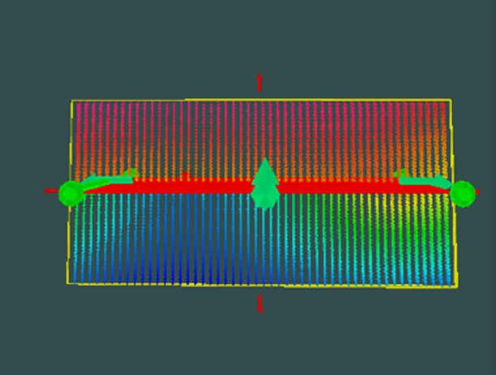
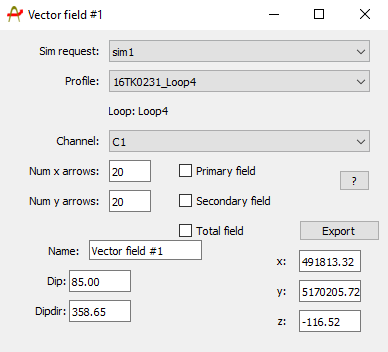

## Importing / Creating

Once a conductor has been created, it is possible to create a vector field intersecting the surface. To create a vector field the user can press CTRL + Right click in the approximate area of interest and select the "create vector field" option. Once the vector field is created the user can then move the vector field to the desired location usually this will be intersecting the conductor in some fashion.

An example of a vector field and the steps taken to create it: <https://youtu.be/l17XcP0bT4Q>

## Object specific dialogue

The vector field can be selected using CTRL + Left Click, once the vector field is selected (highlighted yellow) pressing enter will open the vector field dialog window that is used create set the parameters for the representation of the magnetic field. Note that the process of creating a vector field should occur after the conductor has been used in a simulation. 
This dialog window is shown below:

Once a conductor has been created, it is possible to create a vector field intersecting the surface. To create a vector field the user can press CTRL + Right click in the approximate area of interest and select the "create vector field" option. Once the vector field is created the user can then move the vector field to the desired location. The vector field can be selected using CTRL + Left Click, once the vector field is selected (highlighted yellow) pressing enter will open the vector field dialog window that is used create set the parameters for the representation of the magnetic field. Note that the process of creating a vector field should occur after the conductor has been used in a simulation.

The dialog window allows the user to select the following variables of the vector field:

* **A graphical representation of the primary, secondary or total field interaction with the selected conductor**

* **The number of arrows in the x and y orientation**
    * Will determine the density of the vector plot (note: more arrows will result in a more resource intensive field calculations and thus a longer associated runtime)

* **The representation of the magnetic field at a given time after transmitter shut-off (channel)**