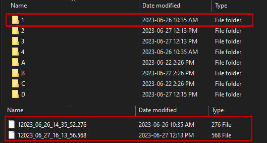
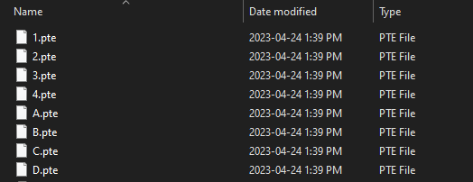

The conductor cache folder is a subdirectory in the Provus project directory in which provus will store all previous iterations of a given conductor as .pte for plate conductors or .csv files for ribbon conductors. The conductor cache an important directory to reference in the case of a crash to recover conductors or previous conductor states.

The Provus conductors subdirectory is where the current state of all project conductors are stored. It is also the directory where users can drag and drop in new conductors to the project. For example if the user has created a conductor outside of provus it may be imported to the active project by placing it in this directory. For more information on the expected format of .csv conductor files visit the appendix. 

