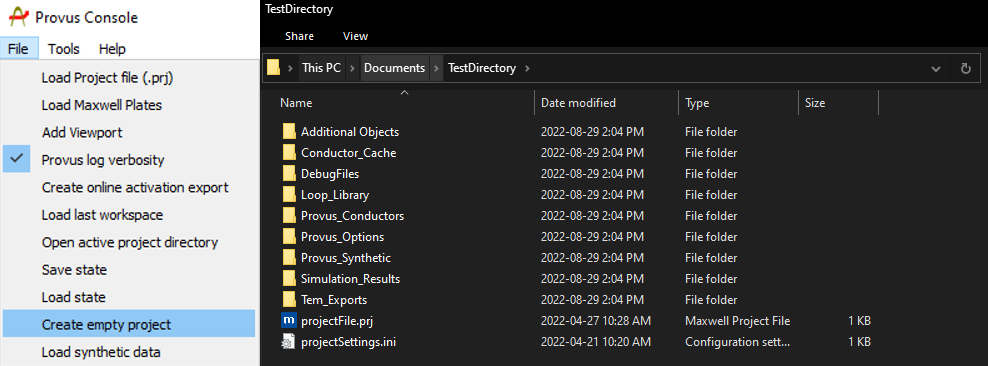

To start a new project in Provus, navigate to the Provus console and select the "Create empty project" option under the file dropdown menu in the top left of the window. Upon selecting this option, Provus will prompt the user to select a folder to populate as the project directory, an example of the resulting directory is shown below. This directory is where the user can import data into their respective sub directories, the purpose of each subdirectory is detailed below.

