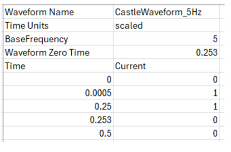
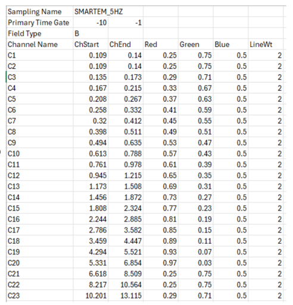

The Provus options folder contains waveforms and channel sampling schemes for different EM systems in the form of csv files. The file names for the waveform and channel sampling scheme must be included in the data profile (.TEM) header prior to import in to Provus. An example of a csv file defining the transmitter waveform is given below. If the "Time Units" line is missing it assumes the values are entered in scaled units. Scaled units are dimensionless units of time scaled to a waveform period at the stated base frequency. Only one half of the waveform is defined, there should be exactly a half-period difference between the first and last time in the waveform definition table.

The sampling file defines the system sampling scheme. The sampling name is found on the first line and is what Provus uses to register the sampling (not the file name). It is converted to all upper case when loaded. The primary time gate is used to compare with data collected in the on-time used for validating system polarity. It can be the same as one of the standard time gates. The field type is case insensitive and is one of "b", "b-field", "b-field", "db/dt", or "v" for voltage. The color components are in the range of (0-1). The list of channel names and the start and end time are given in ms.

