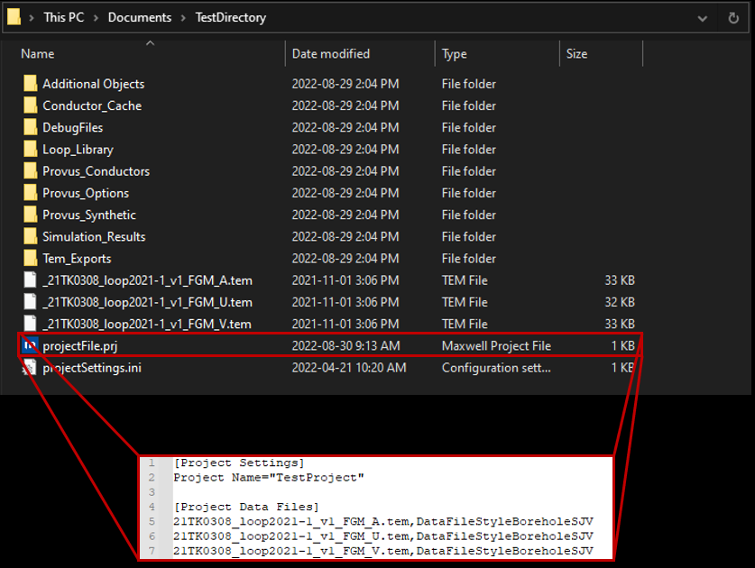

When an empty project is created in Provus a project file will be generated and placed in the root directory. The project file will be edited by the user to include the project name and the path to the data profies (.TEM) that will be imported to the project. Once the data has been placed in the root directory, the user can then edit the project file with a text editor and add a pointer to the profile data (file name) and the style sheet that is used to load the data seperated by a comma. An example of what this looks like in a text editor is shown below. It should be noted that the data style will change based on the system used to collect the data, see appendix for more information.

