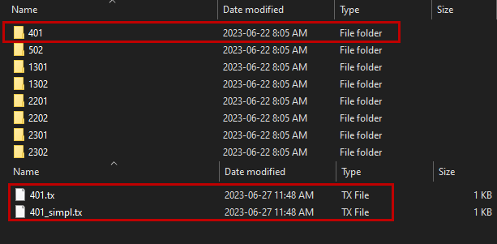

There are two ways of importing transmitter loops into Provus, including the loop coordinates in the data profiles (.TEM files) or placing a separate loop file into the loop library folder. The loop file is expected to be in the format of a csv containing the loop coordinates. For large transmitter loops or loops that are used repeatedly it can be advantageous for the user to reduce the number of vertices and place this low res or simplified version of the loop file in the loop library folder. 

