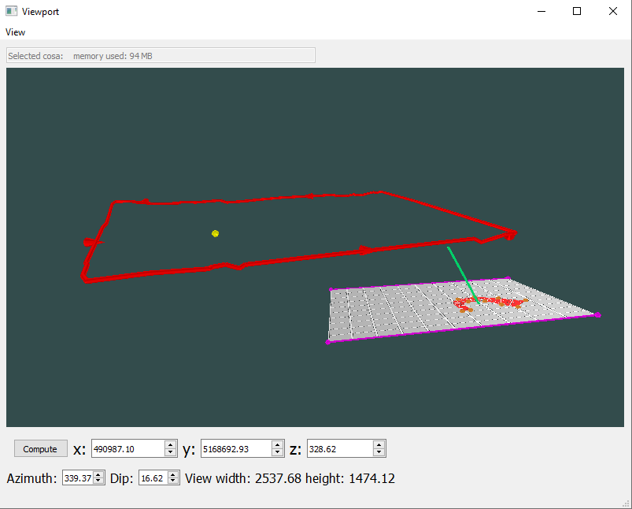
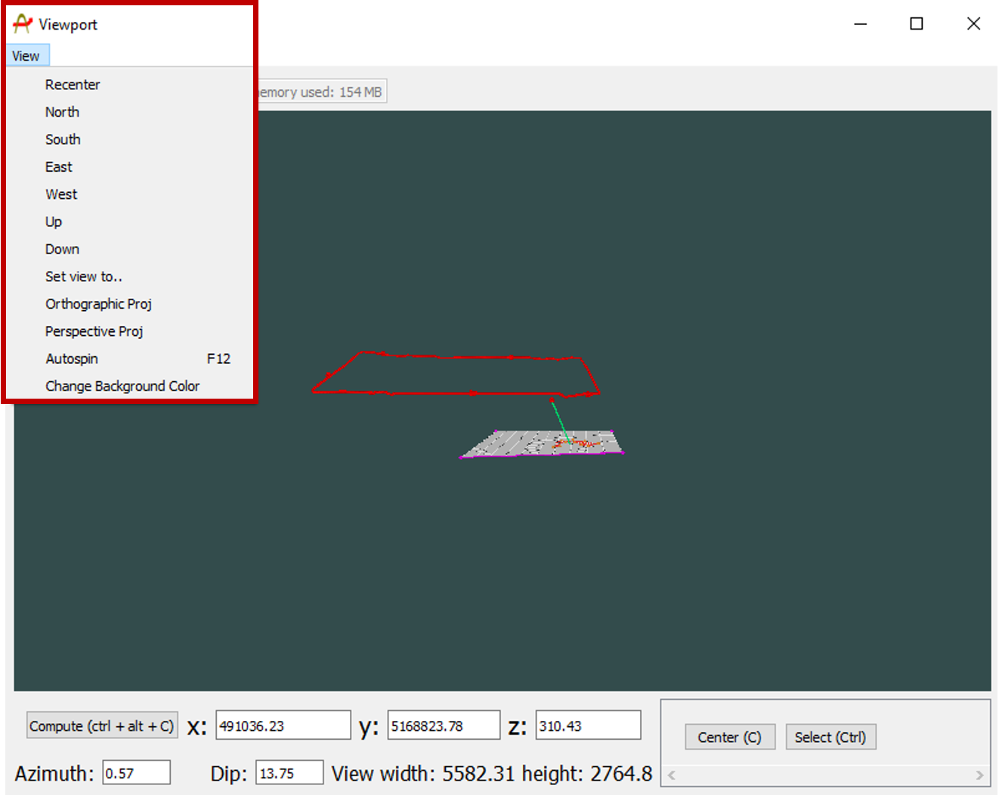
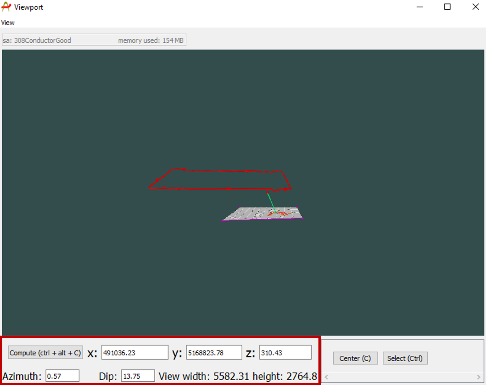
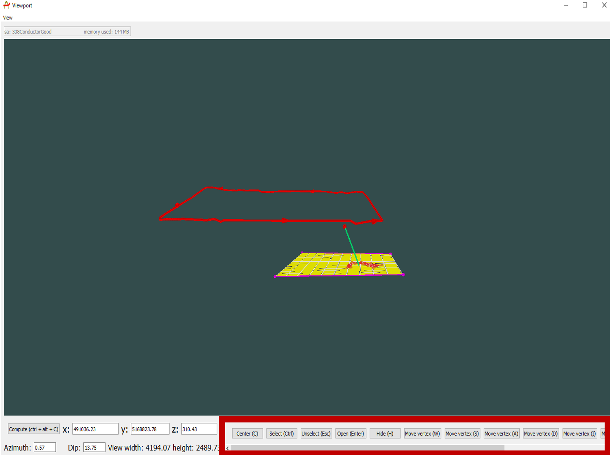
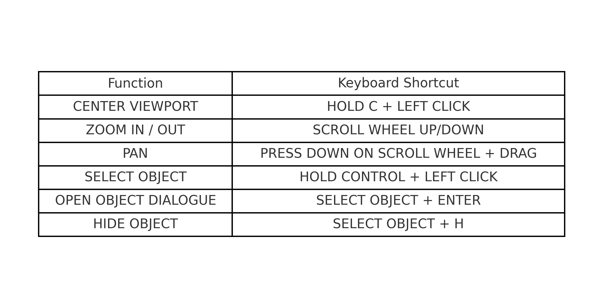

The viewport is a general-purpose 3D viewer that allows the user to visualize and interact with all objects that have been imported or created within Provus. 

The viewport will automatically be populated with the content of the world tree, the objects being visualized in the world tree may be toggled as visible or hidden by checking or unchecking the associated box in the world tree.

At the top let of the view port there is a "view" drop down menu. This dropdown menu allows the user to recenter the viewer with respect to a cardinal direction, this can be useful to refresh the viewer upon import or creation of new objects. The dropdown menu also allows the user to change the type of projection and the background color of the viewer.

The bottom of the viewport displays the xyz coordinate, stike and dip of the point of reference. At the bottom left of the viewer there is a compute button which will perform a simulation using the current conductor configuration.(computing from the viewport rather than navigating to the simulation widget can save the user time).

The bottom right of the viewport is where the keyboard shortcuts for moving & interacting with objects resides. The user can reference this cluster in the bottom right when moving or transforming conductors or other objects in the viewport. The hotkeys displayed in this area will reflect the current object that is highlighted. An example is shown below for the case where a ribbon conductor is highlighted in the viewport.

Below is a short list of universal commands that can be used to navigate in 3D space within the view port and a link to a screen recording depicting the action. 

1. Mouse scroll wheel up / down: zoom in & out within the viewport 

2. Moving the mouse while holding left click: rotate pov in all directions 

3. Moving the mouse while holding down the scroll wheel: pan/move in all directions

4. While holding "c" left click anywhere in the viewport to recenter your view

Below is an image containing all of the viewport keyboard shortcuts

